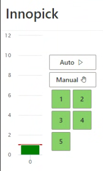

# Daily Operations

**[Home](../index.md) > Daily Operations**

---

## Overview

This section covers the standard procedures for operating InnoPick Manager on a daily basis, including startup, monitoring, and shutdown procedures.

---

## Startup

Complete checklist for beginning operations each day, including visual inspection, login, and enabling automatic mode.

### Pre-Startup Visual Inspection:

Before powering up or enabling the system, conduct a thorough visual inspection of InnoPick:

**Check for:**

- Cases that are out of place or fallen
- Maintenance tools or equipment left on the machine
- Damaged cases or debris on conveyors
- Any unusual conditions or spills
- All safety guards and doors are properly closed
- E-Stop buttons are in the released (pulled out) position

**Action**: Remove any foreign objects and correct any unsafe conditions before proceeding.

---

### Startup Procedure

#### Access InnoPick Manager

1. Open a web browser at your operator terminal
2. Navigate to the InnoPick Manager web address
3. Log in using your username and password

See [Logging In](../getting-started/login.md) for detailed instructions if needed.

---

#### 2. Review System Status

Once logged in, you'll see the [Home Page](../main-screens/home-page.md):

1. **Check for existing alerts**
   
    - Review the Alerts List on the Home Page
    - If alerts are present, see [Resolving Alerts](../troubleshooting/alert-guidelines.md)
    - Clear any alerts from previous shift

2. **Check level statuses**
   
    - All levels should show their current mode (Manual/Auto/Fault)
    - Verify the system is in the expected state
    - Each level must be in Manual mode (Yellow) in order for it to be put into Auto mode.

3. **Review disabled lanes**
   
    - Check for disabled lanes on all levels
    - Check with maintenance staff if any disabled lanes can be put re-enabled following maintenance work.

---

#### 3. Put InnoPick into Automatic Mode

Once you've verified the system is ready:

1. **Click the Auto button** to put all levels into Auto mode

   

2. **Verify the level(s) turn green** indicating Automatic mode

**Important**: Only enable Automatic mode if:

- Visual inspection is complete
- No unresolved alerts exist
- All safety devices are functional
- Nobody is inside the InnoPick safety fence
- You're ready to begin production

---

#### 4. Monitor Initial Operation

After enabling Automatic mode:

1. **Watch the first few cycles** to ensure smooth operation
2. **Listen for unusual sounds** that might indicate problems
3. **Check the Inventory Graph** to verify cases are moving as expected on all levels
4. **Monitor for new alerts** 

See [Monitoring Production](index.md#monitoring-production) for ongoing monitoring procedures.

---

### Startup After Extended Downtime

If the system has been shut down for more than 24 hours:

1. Perform a more thorough visual inspection
2. Verify all utilities are functioning (power, air pressure, network)
3. Check with maintenance that all scheduled work is complete
4. Manually jog any lanes or sequence conveyor chains that have had maintenance work done on them
5. Allow a few moments for systems to initialize
6. Test one level in Automatic mode before enabling all levels

---

### Troubleshooting Startup Issues

#### System Won't Enter Automatic Mode

**Possible Causes:**

- Active alerts must be cleared first
  - If no alerts appear at first, go to Alerts Page and remove all filters to see *all* alerts. 
  - Because InnoPick automatically filters out alerts it thinks are not critical, sometimes an important alert is not immediately visible. 
- E-Stop or door is open
- Upstream or downstream systems not ready

**Solution:** Check the [Alerts Page](../main-screens/alerts-page.md) for details

---

## Shutdown

Proper procedures for ending the shift and securing the system.

### 1. Verify Production is Complete

Check that there are no:

- **In Progress Cases**: Cases currently being processed on sequence conveyors
- **Incomplete Cases**: Cases scheduled but not yet completed
- **Pending Cases**: Cases in the case sequence waiting to be processed
- **Active Replenishments**: Replenishments currently inducting or in progress

**If production is not complete:**

- Coordinate with supervision about completing or postponing remaining orders
- Allow system to finish current work before proceeding
- Document any incomplete work for the next shift

---

***

___

### 2. Put InnoPick into Manual Mode

- On the [Home Page](../main-screens/home-page.md), click the **Manual** button

   

- Verify all level indicators turn **Yellow** (Manual mode)

**Why Manual Mode?**

- Prevents the system from automatically starting new moves
- Allows safe inspection and shutdown
- Ensures system won't start unexpectedly

---

### 3. Conduct Visual Inspection

Perform a walk-around inspection of InnoPick:

**Check for:**

- Cases out of place or fallen
- Cases left on conveyors
- Any damage to equipment or cases
- Spills or debris that need cleanup

**Document any issues:**

- Report safety concerns or mechanical issues to supervision

---

### 4. Log Out

1. Click on your username or logout button
2. Confirm logout
3. Close the browser

**Security Note**: Always log out when leaving your workstation to prevent unauthorized access.

---

### 5. Suggested: Open an InnoPick Door

- It is recommended to request access to an InnoPick door, as this removes all latent electrical and pneumatic energy from the system
- This puts the system into a state equivalent to E-Stop
- Reduces wear on certain components

---

## Essential Skills for Operators

To effectively operate InnoPick, you should be familiar with:

1. **System Status Monitoring**
   
    - Understanding level status colors (Green/Yellow/Red)
    - Reading the inventory graph
    - Monitoring production progress

2. **Alert Management**
   
    - Recognizing common alerts
    - Basic alert resolution
    - When to escalate to maintenance or support

3. **Replenishments Awareness**

    - Understanding replenishment status

---

## Safety Reminders

- Always perform visual inspections before starting equipment
- Never bypass safety interlocks or E-stops
- Ensure all personnel are clear before resuming automatic operation
- Report any unsafe conditions to your supervisor

---

**Navigation:** [← Interface Overview](../getting-started/interface-overview.md) | [Monitoring Production →](monitoring.md)