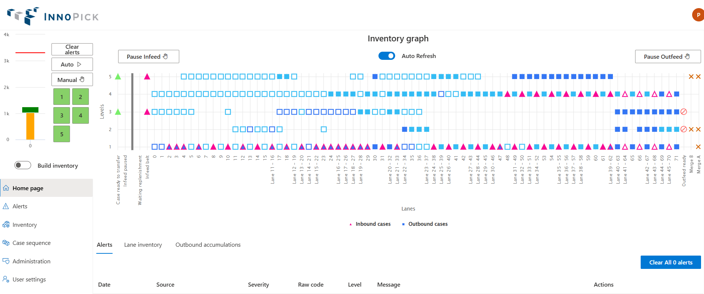

# Interface Overview

**[Home](../index.md) > [Getting Started](index.md) > Interface Overview**

---

## Main Navigation

After logging in, you'll see the InnoPick Manager interface with a navigation menu on the left side of the screen. This menu is available from any page within the application.

### Primary Navigation Buttons

Six main navigation buttons are always accessible on the left side:

1. **[Home Page](../main-screens/home-page.md)**

   - System overview and real-time status
   - Visual representation of cases and conveyors
   - Current alerts and production progress

2. **[Alerts](../main-screens/alerts-page.md)**

   - Current and historical alert listing
   - Alert filtering and search functionality

3. **[Inventory](../main-screens/inventory-section.md)**

   - Replenishments management
   - Product configuration
   - Lane inventory tracking
   - Accumulation monitoring
   - Product statistics

4. **[Case Sequence](../main-screens/case-sequence.md)**

   - Order of cases exiting InnoPick
   - Case tracking and filtering

5. **[Administration](../main-screens/administration.md)**

   - System configuration (authorized users only)
   - Manual operations
   - User management
   - Recovery actions
   - Operations Settings

6. **[User Settings](../main-screens/administration.md#user-settings)**

   - Personal preferences
   - Account settings

---

## Screen Layout

Each screen in InnoPick Manager follows a consistent layout:

### Top Section

- User information and logout option
- Current system date/time
- Navigation breadcrumbs (on some pages)

### Left Sidebar

- Main navigation buttons
- Quick access to all major sections

### Main Content Area

- Primary information display
- Interactive controls and buttons
- Data tables and visualizations

### Bottom Section

- Action buttons (Clear Alerts, Save, Cancel, etc.)
- Status indicators

---

## Common Interface Elements

### Status Indicators

**Level Status Colors**:

- **Green**: Automatic mode - system is running or ready
- **Yellow**: Manual mode - system is paused
- **Red**: Fault mode - system has an active alert
- **Dark Red**: E-Stop active - safety system engaged
- **Blue**: Communication Loss

### Interactive Elements

**Clickable Icons and Buttons**:

- Colored level numbers can be clicked to change mode
- Three-dot menus (⋮) reveal additional actions
- Blue hyperlinks navigate to related information
- Hover tooltips provide additional details

**Data Tables**:

- Column headers can often be clicked to sort
- Search bars filter table contents
- Action columns contain buttons for specific operations

---

## Navigation Tips

### Getting Around Efficiently

1. **Use the Home button** to quickly return to the main overview
2. **Bookmark frequently-used pages** in your web browser
3. **Use browser Back/Forward** buttons to navigate your history
4. **Open links in new tabs** (right-click, "Open in new tab") to keep your place

### Finding Information Quickly

- Use the search features in data tables
- Check the Alerts page for system status issues
- Use the Home Page for at-a-glance system overview
- Reference this manual's index for specific topics

---

## Understanding Access Restrictions

Based on your user role, you may see some menu options grayed out or missing entirely:

- **Guest users**: Can view most screens but cannot modify settings or control equipment
- **Clerk users**: Can operate the system but cannot access configuration
- **Manager users**: Can access operational controls but not site setup
- **Admin users**: Have full access to all features

If you need access to a restricted feature, contact your supervisor or system administrator.

---

## Next Steps

Now that you understand the interface layout, you're ready to:

- Learn [Daily Operations](../daily-operations/index.md) procedures
- Explore the [Main Screens](../main-screens/index.md) in detail
- Review [Troubleshooting](../troubleshooting/index.md) procedures

For routine operation, proceed to [Daily Operations: Startup](../daily-operations/index.md#startup).

---

**Navigation:** [← Logging In](login.md) | [Next: Daily Operations →](../daily-operations/index.md)