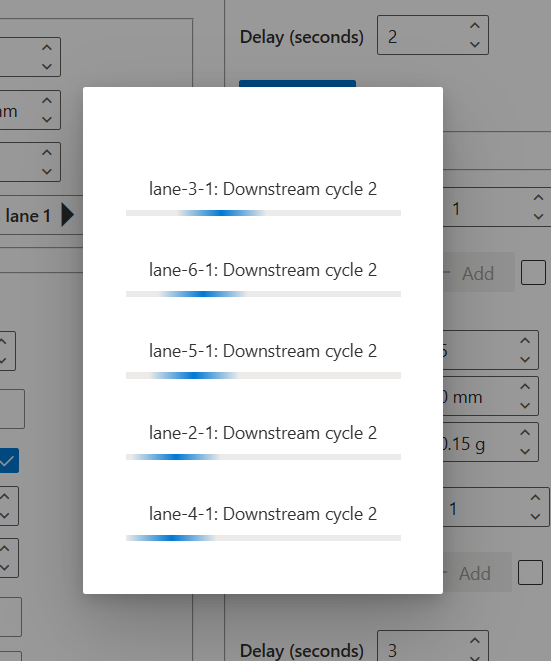

# Manual Motion Control

**[Home](../../index.md) > [Main Screens](../index.md) > [Administration](index.md) > Manual Motion Control**

The Manual motion control page provides manual control of InnoPick conveyors for troubleshooting and maintenance purposes.

### Four Main Sections

1. Level Operations - Control sequence conveyors
2. Lane Operations - Control individual buffer lanes
3. Level Saga Operations - Pre-program multiple sequence conveyor moves
4. Lane Saga Operations - Pre-program multiple buffer lane moves

### Level Operations

Manually jog the sequence conveyor of a selected level.

#### Controls

**Select Level:**

- Choose which level to control

**Jog Distance:**

- Default: 558mm (22 inches) - standard move
- Can be customized as needed
- Measured in millimeters

**Acceleration:**

- Set in g's (gravitational force)
- Controls how quickly the conveyor accelerates and decelerates

**Direction:**

- Forward or reverse
- Typically moves toward outfeed (forward)

#### When to Use

- Troubleshooting positioning issues
- Manual case positioning after alerts
- Testing conveyor operation
- Maintenance and setup

**Important**: Only use in Manual mode when production is stopped.

### Lane Operations

Manually control individual storage lanes and clutch assemblies.

#### Controls

**Level and Lane Selection:**

- Drop-down menus to select specific lane

**Pop Up / Down:**

- Forces the lane's pop-up assembly to move up or down
- Used for manual case handling

**Distance:**

- Default: Width of product in lane (if present), otherwise 0mm
- If "Fix Distance" option is unchecked, the system will automatically set the Jog lane distance to according to the product in the lane (if applicable)

**Directions:**

- **Storage**: Move into the lane (backward)
- **Dispense**: Move toward sequence conveyor (forward)

#### When to Use

- Clearing jammed cases
- Manual case positioning
- Testing lane operation
- Maintenance procedures

**Caution**: Be aware of case positions before jogging lanes.

### Level & Lane Saga Operations

These interfaces allow pre-programming multiple moves in sequence.

To use these controls:

- Enter in the # of iterations and specify the level(s) & lane(s), as well as a delay.
- The delay is necessary to allow the system to complete the manual move before the next move in the sequence is commanded.
- While the manual moves are being executed, the page will display something like this:

#### Purpose

- Execute a series of moves
- Testing and validation after mechanical work
- Break-in of equipment at installation
- Advanced troubleshooting scenarios

#### Usage

Primarily used by:

- System integrators
- Advanced maintenance personnel
- During commissioning and testing

**Navigation:** [← Administration](index.md) | [Setup InnoPick →](setup-innopick.md)