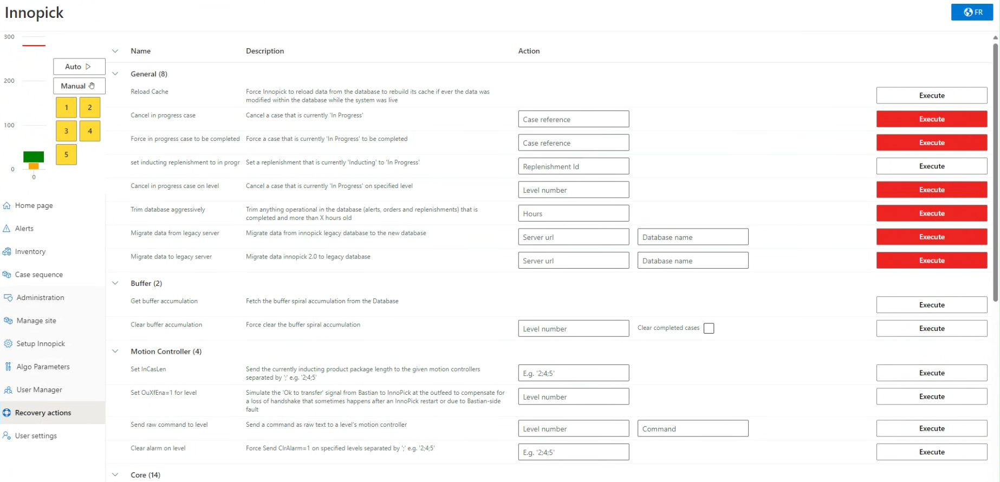

# Recovery Actions

**[Home](../../index.md) > [Main Screens](../index.md) > [Administration](index.md) > Recovery Actions**

---

Recovery Actions are built-in features for dealing with specific issues that arise during operation.

### Purpose

Provide operators and support personnel with:
- Tools for recovering from unusual situations
- Options for resolving issues that can't be handled through normal procedures
- Advanced troubleshooting capabilities

### Recovery Action Groups

#### General
- System-wide recovery actions
- General troubleshooting tools

#### Buffer
- Actions related to accumulation management
- Output buffering issues

#### Motion Controller
- Actions related to conveyor motion
- Drive and motor issues

#### Core
- Core system recovery actions
- Advanced system state management

### Using Recovery Actions

Recovery actions include a description of what it does and some of them require the operator to put in some required information (in the Action column). 
- If a recovery action has an input field for the operator to put in information, it typically will not work unless it has that information.

**Important**: 
- Understand the action before executing
- Document which recovery actions were used
- Consult with support if unsure

**Note**: The list of available Recovery Actions may change depending on:
- System version
- Integrator customizations
- Specific installation needs

### Most Commonly Used Recovery Actions

#### Set case pending completion
This recovery action resends the outfeed case data to the downstream conveyor system. 
- This is used when recovering from issues at the outbound transition (handshake), when the downstream conveyor system does not have the tracking data for the case currently on the last InnoPick position.
  
#### Set InCasLen 
This recovery action re-sends the case length to the motion controller for the currently inducting product on a given level. 
- This is used when after a system restart or some other abnormal stoppage, cases are not entering InnoPick infeed even though everything else is good, and the replenishment is in the *Inducting* state.

#### Set OuXfEna=1 for level
This recovery action simulates the "OK to Receive" signal from the downstream conveyor system to InnoPick, which is the last step in the outfeed handshake process. 
- This can be used when the downstream conveyor system has tracking data for the case, but InnoPick is not advancing the physical case from the last position. 

#### Clear alarm on level
This recovery action sends a 'clear alarm' signal to the motion controller for a given level. 
 - This is used when a fault or alert on the InnoPick system refuses to clear normally, but the underlying conditions that caused the alarm have been resolved (meaning it should be able to clear). 

#### Clear level processor error
This recovery action clears internal processor errors and restarts the level processor for a given level. 
- This is used after certain critical faults whose descriptions indicate to the operator that the level processor has been stopped. 

---

**Navigation:** [← User Manager](user-manager.md) | [Operations →](operations.md)