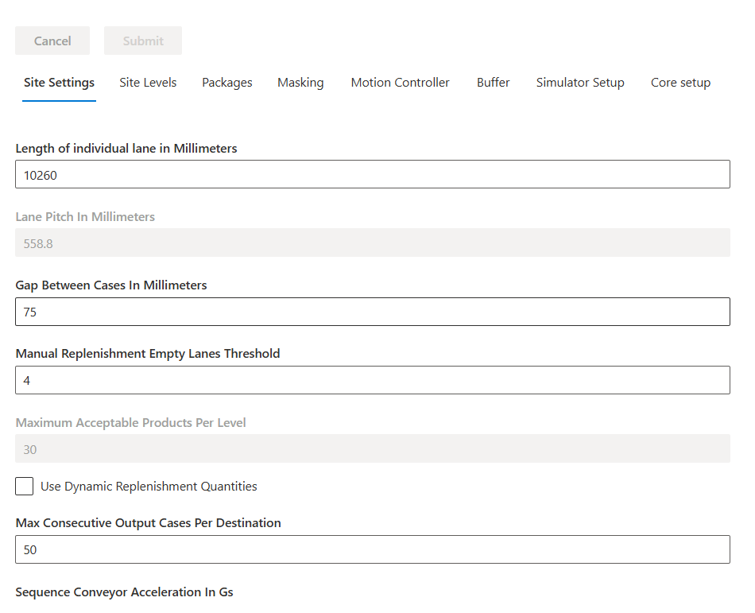

# Setup InnoPick

**[Home](../../index.md) > [Main Screens](../index.md) > [Administration](index.md) > Setup InnoPick**

### Setup InnoPick Sub-Sections:
- [Site Settings](#site-settings)
- [Site Levels](#site-levels)
- [Packages](#packages)
- [Masking](#masking)
- [Motion Controller](#motion-controller)
- [Buffer](#buffer)
- [Simulator Setup](#simulator-setup)
- [Core Setup](#core-setup)

The Setup InnoPick page contains configuration settings for InnoPick's internal operation. Access is typically restricted to Admin users and system integrators.

### Site Settings

[Back to Setup InnoPick Sub-Sections](#setup-innopick-sub-sections)

Critical system-wide configuration parameters.

#### Gap Between Cases in Millimeters

The gap InnoPick maintains between cases stored in buffer lanes.

**Purpose:**
- Prevents cases from pressing together
- Allows smooth dispensing
- Accommodates case size variations
- **Note:** Do not change this parameter unless directed to system expert / remote support.

#### Manual Replenishment Empty Lanes Threshold

Minimum number of empty lanes required before IPM allows manual replenishment creation.

**Purpose:**
- Ensures sufficient space for manual replenishments
- Prevents overfilling storage capacity

#### Use Dynamic Replenishment Quantities

Enable/disable IPM's ability to dynamically adjust replenishment quantities based on demand patterns.

**When enabled:**
- IPM analyzes usage patterns
- Adjusts quantities automatically
- Optimizes inventory levels

**When disabled:**
- Uses static configured quantities
- More predictable but less adaptive

**Note**: Should be managed by system integrators.

#### Max Consecutive Output Cases Per Destination

Limits consecutive cases sent to a single destination (Merge A, B, etc.).

**Purpose:**
- Balances output across destinations
- Prevents overwhelming single destination
- Contingent on other function being enabled

**Note**: Should be managed by system integrators.

#### Sequence Conveyor Acceleration / Deceleration in Gs

Acceleration rate for sequence conveyor indexing moves.

**Measured in:** g's (gravitational force)

**Considerations:**
- Higher = faster moves but more case disturbance
- Lower = gentler but slower throughput
- Balance between speed and stability

#### Additional Configuration Options

Other settings visible on this page are for:
- Initial system setup
- System integration
- Advanced configuration

**Warning**: Do not change these without consulting system integrators.

### Site Levels

[Back to Setup InnoPick Sub-Sections](#setup-innopick-sub-sections)

This page contains level-specific configuration settings:
**Lane Pitch in Millimeters**
  - Value (in mm) representing the standard distance between storage lanes
  - **Note**: Values may differ slightly per level due to:
    - Chain stretch over time
    - Tensioning adjustments
    - Mechanical variations
  - **See the [Lane Pitch Adjustment Guide](../../troubleshooting/casecentering.md) for guidance on how to adjust these parameters to ensure good centering on all lanes** 

**Center Placement in millimeters**
  - Controls the initial positioning of a case as it first enters InnoPick infeed.
  - **See the [Lane Pitch Adjustment Guide](../../troubleshooting/casecentering.md) for guidance on how to adjust these parameters to ensure good centering on all lanes** 

**Center offset in millimeters**
  - Adjusts the expected centerpoint of infeed cases.
  - If there are midpoint alarms being generated despite the cases looking nicely centered, then this parameter needs to be adjusted. 
  - Contact system integrators if adjustment is needed.

**Length offset in millimeters**
  - Adjusts the expected length by this amount

**Target offset in millimeters**
  - Adjusts the final case placement when dispensing a case

**Send variables to Galil**
- Press this after making a change to one of the variables in this section, followed by the 'Submit' button at the top of the page.

### Packages

[Back to Setup InnoPick Sub-Sections](#setup-innopick-sub-sections)

Product configuration page for system setup.

**Access**: System integrators during initial setup

### Masking

[Back to Setup InnoPick Sub-Sections](#setup-innopick-sub-sections)

Configuration for masking certain system moves.

**Access**: System integrators during initial setup

### Motion Controller

[Back to Setup InnoPick Sub-Sections](#setup-innopick-sub-sections)

Connection and configuration for the motion controller.

**Access**: System integrators during initial setup

### Buffer

[Back to Setup InnoPick Sub-Sections](#setup-innopick-sub-sections)

Configuration for accumulation management and output buffering.

#### Number Of Cases To Exit Merge In The Accumulation LookAhead
How many cases IPM considers when forecasting and scheduling output.

Impact:
- **Higher number**: More aggressive scheduling, uses more accumulation
- **Lower number**: More conservative, leaves accumulation space unused

*Too high*: Risk of misjudging available space, may block output more often
*Too low*: Underutilizes accumulation, reduces throughput
*Recommendation*: Determine empirically based on system performance

#### Buffer Enabled
(Default = On)

When enabled, InnoPick keeps track of the cases in the outbound accumulation to optimize outbound scheduling when space is available and pause outbound scheduling to allow inbound to keep entering when the outbound is full.

**When enabled:**
- IPM actively manages accumulation
- Schedules output based on available space
- Prevents overloading downstream equipment

**When disabled:**
- IPM schedules output independently of accumulation status
- Simpler but may cause downstream congestion issues

#### Build Inventory

InnoPick can operate in two modes regarding accumulation:

##### Normal Operation Mode
- IPM schedules as many output cases as possible, using Buffer logic if that option (see above) is enabled
- Assumes downstream conveyors advance at nominal rate
- Maximizes throughput
- May occasionally have to stop if outbound flow stops unexpectedly

##### Build Inventory Mode
- IPM prioritizes building lane inventory over outputting cases
- Only schedules output cases that will definitely fit in current accumulation space 
- More conservative approach
- Level should not have to stop due to full accumulation
- Allows continuous replenishment induction

**When to enable:**
- Starting production with low inventory
- Recovering from downstream stoppage
- Building to nominal inventory levels

**When to disable:**
- Normal production operations
- When inventory is at nominal or above
- To maximize throughput

**Note: Build Inventory Mode can be turned on and off directly from the set of controls that are always visible in the top left corner of the InnoPick Manager screen:**

**Destination Decoupling Mode Enabled**
- Allows InnoPick to schedule cases for multiple destinations in parallel based on downstream accumulation availability and inventory. 
- If InnoPick cannot schedule the next outbound case for the next priority pallet, it is allowed to look for pallets further down the sequence for other destinations and attempt scheduling them if accumulation and inventory allows it.
- This mode is affected by the two parameters below:

**Destination decoupling mode max pallet offset**
- This is configuration parameter for the "Destination Decoupling Mode Enabled" above.
- See the description beneath the setting.
  
**Destination decoupling mode max case offset**
- This is configuration parameter for the "Destination Decoupling Mode Enabled" above.
- See the description beneath the setting.

#### Destination A / B Accumulation

These settings teach InnoPick about various accumulation zones for its algorithmic calculations. 

**Shared zone accumulation (# of zones)**
- This setting teaches InnoPick how many cases can fit between the exit of the merge and the palletizer. 

**Level 1 to 5: Accumulation Length in Mm**
- This setting teaches InnoPick the length of low pressure accumulation where cases are accumulated in a way that they bunch up together with no gaps. 

**Level 1 to 5: Zone Accumulation (# of zones)**
- This setting teaches InnoPick how many individual cases can be accumulated between the exit of InnoPick and the merge. 

### Simulator Setup

[Back to Setup InnoPick Sub-Sections](#setup-innopick-sub-sections)

Configuration page for developers and system testing.

**Access**: System integrators and developers

### Core Setup

[Back to Setup InnoPick Sub-Sections](#setup-innopick-sub-sections)

Core system parameters for developers.

**Access**: System integrators and developers

**Navigation:** [← Manual Motion Control](manual-motion-control.md) | [Algorithm Parameters →](algo-parameters.md)