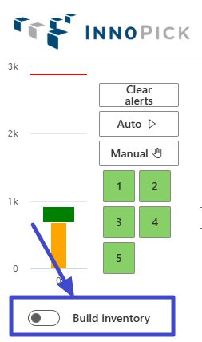
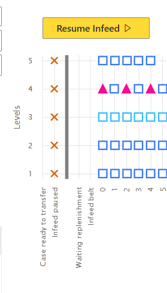
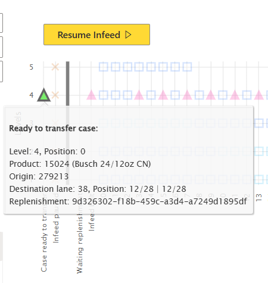
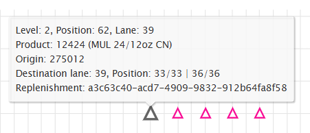
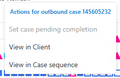
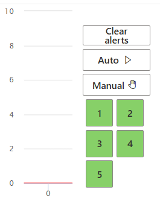
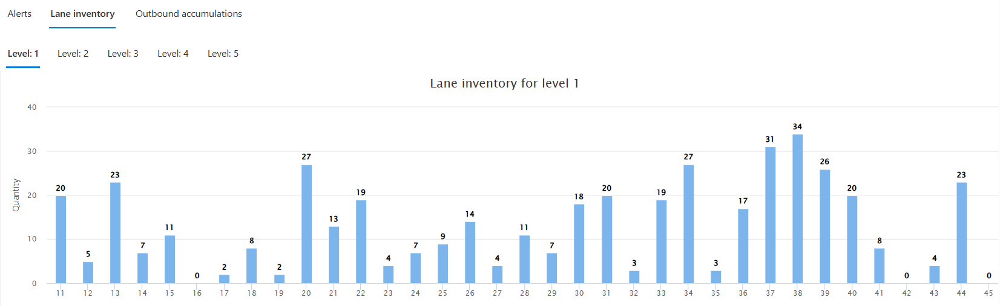
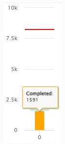

# Home Page

**[Home](../index.md) > [Main Screens](index.md) > Home Page**

---

## Overview

The Home Page is your primary dashboard for monitoring InnoPick operations. It provides a real-time snapshot of system status, case locations, alerts, and production progress.

---

## Accessing the Home Page

- Click the **Home Page** button in the left navigation menu
- The Home Page appears automatically after logging in
- Available from any screen in InnoPick Manager

---

## Home Page Components

The Home Page displays the following key information:

1. [Inventory Graph](#inventory-graph) - Visual representation of cases on sequence conveyors
2. [Level Statuses & Controls](#level-statuses--auto--manual-controls) - Mode indicators and control buttons
3. [Alerts List](#alerts-list) - Current system alerts
4. [Lane Inventory](#lane-inventory) - Storage lane contents by level
5. [Production Graph](#production-graph) - Progress of current production run

---

## Inventory Graph

The main visual grid in the center-right of the Home Page provides a quick summary of case positions on InnoPick sequence conveyors.

### Understanding the Symbols

**Shapes:**
- **Squares** = Outbound cases (scheduled for customer pallets)
- **Triangles** = Inbound cases (replenishments being stored in lanes)

**Fill Status:**
- **Filled shapes** = Physical case is present at that position
- **Hollow shapes** = Position is empty or case is expected
  - If a triangle, it means the case has been stored
  - If a square, it means the case is scheduled to be dispensed on this position

**"Gender Bender" cases:** 

- Some Inbound case positions can be re-used as Outbound case positions when the system determines that the inbound case will be stored in a lane upstream of the outbound case's lane.
- This is shown via a special border around the inbound case on the Inventory graph (see screenshot above - cases highlighted in blue rectangle)
- When this case is stored, the triangle will be replaced with a square.

### Operational Controls on the Inventory Graph
#### Build Inventory Mode

- Build Inventory mode prioritizes letting replenishment cases come into InnoPick over scheduling output cases. 
- [More information on Build Inventory Mode](/main-screens/administration.md#build-inventory) 

#### Pause / Resume Infeed

- Click the **Pause Infeed** button to pause incoming cases
- Cases will stop and wait on the first infeed position of InnoPick

- Click the **Resume Infeed** button to resume incoming cases.

#### Pause / Resume Outfeed

- Click the **Pause Outfeed** button to pause outgoing cases
- Cases will stop and wait on the last position of InnoPick

- Click the **Resume Outfeed** button to resume outgoing cases.

### Interpreting the Display

The inventory graph shows:
- Cases currently on all sequence conveyor positions, with the storage lanes displayed below the graph, indicating their position vertically.
- Various statuses of the transition points at both Infeed and Outfeed:

#### Statuses at the Infeed

##### Case ready to transfer
- When a case is to be transferred from the upstream conveyor system, it appears as a coloured triangle on that level.
- Hover over the triangle to get more information:

##### Waiting replenishment

- When a level InnoPick is not able to schedule output cases because it is waiting for a replenishment, an **x** appears at that level.
- This allows an operator to know immediately why a given level is not scheduling output cases.

##### Infeed paused
- [See above](/main-screens/home-page.md#pause--resume-infeed)

#### Statuses at the Outfeed

##### Merge A / B
- If InnoPick calculates that a certain destination (Merge A or Merge B) cannot receive any more cases, it will stop scheduling output cases for that destination and indicate this with an **X** on the given level and over the given destination.

##### Outfeed ready
- If there is a case on the last position of InnoPick and the downstream conveyor system is not ready to receive it, a stop logo appears.
- Hover over the stop logo to get more information:

### Getting More Information

#### Hover for Details:

Hover your cursor over any case icon to see additional information:

Information includes:
- Level #, current position #, and lane # (if applicable).
- Product SKU and description
- Origin PalletID / HUID
- If Inbound case:
  - Destination lane
  - Position: the position of the case in the storage lane; followed by the position of the case in terms of the total replenishment quantity. In the example in the screenshot above, it is case 33 out of 33 in lane 39; and it was the last case of a 36-case replenishment.
  - Replenishment ID (unique GUID); this can be used to identify the replen in InnoPick and MixMaster.
- If Outbound Case:

  - Merge / Spiral destination
  - Client Order PalletID
  - Case reference number
  - Source lane (where the case was dispensed from)

#### Quick Links
Users can click on: 
##### 1. Replenishment Links:

For inbound cases (triangles), you can click on the case and see a clickable "View replenishment" link:

Clicking this link opens the [Replenishments Page](inventory-section.md#replenishments-page) and displays details for that specific replenishment.

##### 2. Outbound Case Links

For outbound cases (squares), you can click on the case and see between 2 and 3 clickable links:
- **Set case pending completion**: This is only clickable if the case if on the last position of InnoPick. If clicked, a second confirmation will be required in order to execute the recovery action.
  - For detailed information on what this recovery action does, see the [Commonly Used Recovery Actions](../main-screens/administration.md#most-commonly-used-recovery-actions).
- **View in Client**: This will redirect the user to the Case Sequence page in MixMaster where the case can be found.
  - Tip: Right-click and "Open in New Tab" to keep this page open. You may need to login again in the new tab.
- **View in Case Sequence**: This will redirect the user to the Case Sequece page in InnoPick Manager, with a filter applied so only this case appears.
  - Tip: Right-click and "Open in New Tab" to keep this page open. You may need to login again in the new tab.

---

## Level Statuses & Auto / Manual Controls

The numbered squares in the top left corner indicate the operational status of each InnoPick level.

### Status Color Meanings

- **Green**: Automatic mode - level is running or ready for production
- **Yellow**: Manual mode - level is paused
- **Red**: Fault mode - level has an active alert
- **Dark Red**: E-Stop active - safety system engaged
- **Blue**: Communication Loss

### Controlling Level Modes

**To change a level's mode:**
1. Click on the colored level number
2. A pop-up may appear to confirm the mode change
3. The color will change to reflect the new mode

**Mode Control Buttons:**

- **Auto Button**: Puts InnoPick (all levels) into Automatic (production) mode
  - Use when ready to begin or resume production
  - System will autonomously manage case movements

- **Manual Button**: Puts InnoPick (all levels) into Manual mode
  - System pauses automatic operation
  - Used for troubleshooting and maintenance
  - Required in order to jog lanes (manual control) or change certain settings, such as the inventory of a lane.  

### When Levels Are in Manual Mode

When InnoPick has an alarm, the affected level automatically enters Manual (Yellow) or Fault (Red) mode. This pauses production and allows the operator to:

- Assess the problem
- Resolve any issues
- Clear the alarm
- Resume production

---

## Alerts List

The Alerts section shows current system alerts that require attention.

### Clear All Alerts Button

The **Clear All Alerts** button (bottom right of the inventory graph) attempts to clear all current alerts in the system.

There is also a **Clear Alerts** button always visible just above the Auto and Manual buttons:

**Important Notes:**

- If the underlying issue has not been resolved, the alert **cannot** be cleared
- Common reasons alerts won't clear:
  - Photocell sensor still blocked
  - E-Stop button still pressed
  - Door still open
  - Physical case still in wrong position

**When Alerts Won't Clear:**

1. Read the alert message carefully
2. Resolve the underlying issue
3. Try clearing alerts again
4. See [Alert Guidelines](../troubleshooting/alert-guidelines.md) for specific resolution steps
5. Try using the **Clear alarm on level** [recovery action](/main-screens/administration.md#most-commonly-used-recovery-actions).
6. Open the [Alerts Page](/main-screens/alerts-page.md) and remove all filters to see if some other alert could be affecting the system. 
   - Sometimes the system filters out an alert that is still active and cannot be cleared until the underlying issue has been fixed.

### Viewing Complete Alert History

For a full list of all current and past alerts with search and filtering capabilities, see the [Alerts Page](alerts-page.md).

---

## Lane Inventory

The Lane Inventory display shows the contents of storage lanes for each level.

### Selecting a Level

Click on a level number to view its lane inventory.

### Lane Display

Each storage lane is shown as a horizontal bar:
- Bar length represents relative fullness
- The display adjusts automatically to show all lanes for that level

### Getting Lane Details

Hover your cursor over any lane to see:
- Quantity of cases
- Product stored (SKU and description)

### Complete Lane Management

For more detailed lane inventory information and editing capabilities, see the [Lane Inventory Page](inventory-section.md#lane-inventory-page).

---

## Production Graph

The Production Graph on the far left of the Home Page shows the current state of the production run.

### Understanding the Graph

**Red Line at Top:**
- Represents the total number of cases in currently launched orders
- This is the production target

**Green Bar:**

- Represents **In Progress** cases
- These are cases currently on the sequence conveyors (outbound)
- Corresponds to the squares (filled and hollow) on the inventory graph
- Hover to see exact count

**Orange Bar:**

- Represents **Completed** cases
- These cases have been output from InnoPick
- This counter resets periodically as routes/truckloads are completed
- Hover to see exact count

---

## Using the Home Page Effectively

### For Daily Monitoring

The Home Page should be your primary screen during production:

1. **Glance regularly at level statuses** - All should be green during production
2. **Watch for new alerts** - Address immediately when they appear
3. **Monitor production progress** - Verify steady advancement

### Quick Troubleshooting

When an alert occurs:

1. **Check which level** has the issue (red or yellow indicator)
2. **Read the alert message** in the Alerts List
3. **Look at the inventory graph** - does it match physical reality?
4. **Address the issue** per the [Troubleshooting Guidelines](../troubleshooting/alert-guidelines.md)
5. **Clear the alert** once resolved

### Navigation from Home Page

**To investigate issues further:**
- Click level numbers → Changes mode or shows level details
- Click "See replenishment" links → View replenishment details
- Click alerts → Navigate to Alerts page for more information

**To access other features:**
- Use left sidebar navigation buttons
- See [Main Screens Index](index.md) for all available screens

---

## Related Topics

- [Monitoring Production](../daily-operations/index.md#monitoring-production) - How to use the Home Page during operation
- [Alerts Page](alerts-page.md) - Detailed alert information and history
- [Alert Guidelines](../troubleshooting/alert-guidelines.md) - How to resolve alerts
- [Lane Inventory Page](inventory-section.md#lane-inventory-page) - Detailed lane management

---

**Navigation:** [← Main Screens](index.md) | [Next: Alerts Page →](alerts-page.md)