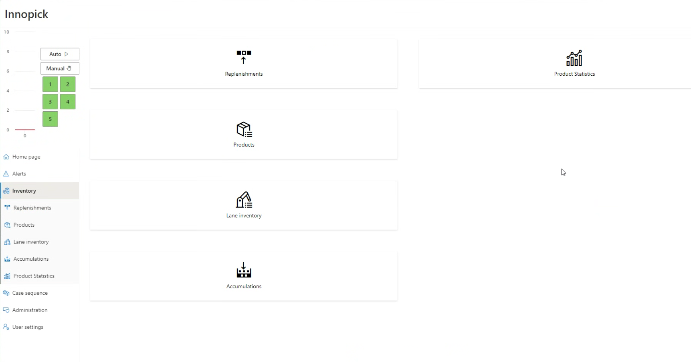
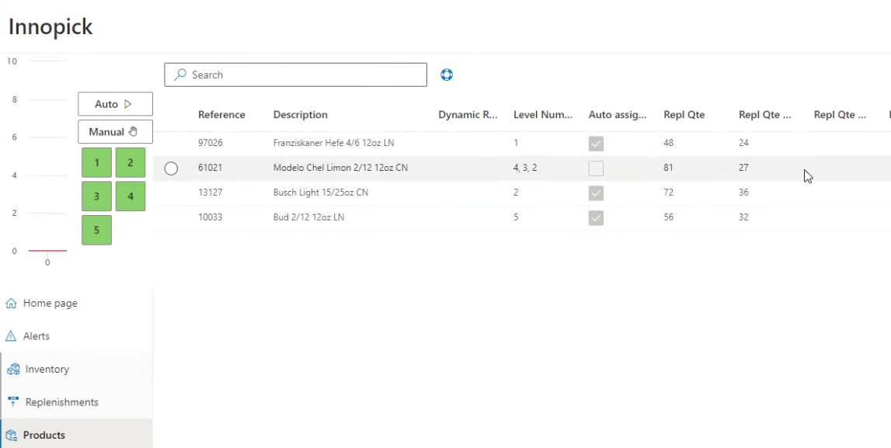
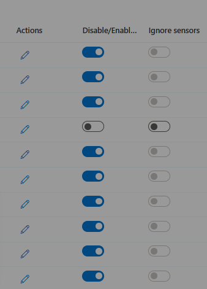
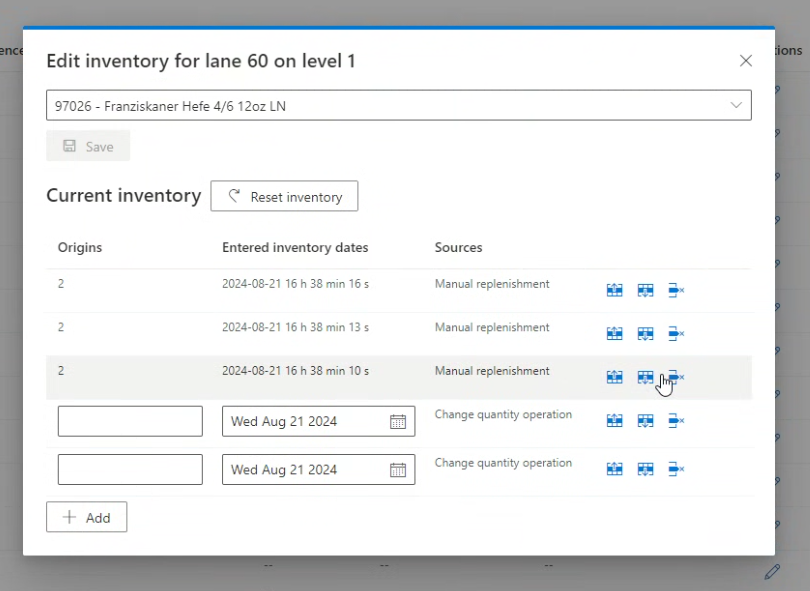
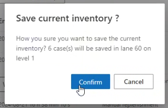

# Inventory Section

**[Home](../index.md) > [Main Screens](index.md) > Inventory Section**

---

## Overview

The Inventory section provides comprehensive tools for managing product replenishments, configuring product parameters, monitoring storage lane contents, tracking accumulation, and analyzing product statistics.

---

## Inventory Section Pages

The Inventory section contains five pages:

1. [Replenishments](#replenishments-page) - Track incoming product replenishments
2. [Products](#products-page) - Configure product settings and parameters
3. [Lane Inventory](#lane-inventory-page) - View and edit storage lane contents
4. [Outbound Accumulations](#outbound-accumulations-page) - Monitor outfeed accumulation space
5. [Product Statistics](#product-statistics-page) - Analyze product usage

---

## Replenishments Page
[Back to Top - Inventory Pages Overview](#overview)

### What Are Replenishments?

Replenishments occur when InnoPick doesn't have sufficient inventory for a particular order. When this happens:

1. InnoPick generates a replenishment request to MixMaster
2. A pallet of the needed product is sent to the replenishment section
3. The pallet is depalletized
4. Cases are inducted into InnoPick

### Replenishment Quantities

A replenishment can range from:
- **Minimum**: A single layer
- **Maximum**: An entire pallet

Replenishment quantities are determined automatically by InnoPick's algorithms unless manually overridden. See [Products Page](#products-page) for manual configuration options.

### Replenishments Page Columns

#### Id
- The GUID (unique identifier) for the replenishment
- Useful for tracking in MixMaster or other systems

#### Sequence
- Number that increases incrementally based on when the need was identified
- Indicates desired order of replenishments for a given level
- Used to prioritize replenishment requests for depalletizing

#### Initiator Case / Pallet
- Details about what triggered the replenishment need
- Shows which customer order created the demand

#### State
Replenishments progress through these states:

- **Pending**: Replenishment is planned but not yet called for depalletizing
- **In Progress**: Anywhere in process from being requested to just before induction
- **Inducting**: Currently being inducted into InnoPick
- **Completed**: Fully inducted into storage lanes

Replenishments can also be **Canceled**

#### Level
- Which InnoPick level the replenishment is assigned to

#### Lanes
- Which storage lanes will receive the replenishment cases

#### Product
- Product SKU code

#### Product Description
- Configured name of the product

#### Desired Quantity
- How many cases were requested in the replenishment

#### Quantity to Induct
- Actual number of cases being sent from depalletizer to InnoPick
- May be less than Desired Quantity if:
  - Source pallet has fewer layers than requested
  - Replenishment was shorted by 1 or more layers during depalletization
  - Cases were rejected at inbound QC station
  - If quantity is insufficient to fulfill the client orders, another replenishment is automatically created

#### Inducted Quantity
- Number of cases successfully inducted to date
- Updates in real-time during induction

### Replenishment Actions

Click the three vertical dots (⋮) on the right side of any replenishment to access these options:

#### In Progress
- Manually changes replenishment status from **Pending** to **In Progress**
  - Only works if the replenishment is in status **Pending**
- Normally set automatically by MixMaster (WCS)
- Use only in exception scenarios when automatic update failed

#### Induct

- Changes status from **In Progress** to **Inducting**
- Only works if:
  - Replenishment is already in "In Progress" state
  - No other replenishment is currently "Inducting" on that level
- Use if there was a communication problem with MixMaster.

#### Alter Quantity

- Allows manual adjustment of replenishment quantity
- Use when cases need to be manually removed before reaching InnoPick
- **Note**: Cases rejected at Inbound QC are automatically deducted

---

## Products Page
[Back to Top - Inventory Pages Overview](#overview)

The Products page displays all products in the InnoPick Manager database with their configuration settings.

### Main Products Page Columns

#### Reference
- The product's SKU code
- Primary identifier for the product

#### Description
- Configured product name
- Human-readable description

#### Dynamic Replen Quantity
- Number of cases in a standard replenishment as calculated by IPM
- Dynamically adjusted based on demand patterns

#### Level Number(s)
- Which levels InnoPick is allowed to use for this product
- Products can be restricted to specific levels

#### Auto Assign Levels
- True/False setting
- When True: InnoPick automatically determines which levels to use
  - **Note:** It is possible to change the level assignment(s) when a Auto Assign is still enabled. This temporarily overrides the algorithm
- When False: Levels must be manually assigned

#### Replenishment Quantity
- Default replenishment size calculated by InnoPick's algorithm
- Based on historical usage patterns

#### Replenishment Quantity Set
- User-defined override for default replenishment quantity
- Use to manually control replenishment size

#### Replenishment Quantity Minimum
- Minimum cases allowed in a replenishment (calculated by InnoPick)
- Must be an even multiple of cases per layer

#### Replenishment Quantity Minimum Set
- User-defined minimum replenishment quantity
- Override automatic calculation if needed

#### Max Quantity / Lane
- Maximum cases that can fit in a storage lane (calculated by InnoPick)
- Based on: lane length, configured gaps, case width

#### Max Quantity / Lane Set
- User-defined maximum quantity per lane
- **Caution**: Do not exceed automatic calculation or cases may go past lane end

#### Acceleration
- Controls how storage lanes handle the product during store/dispense operations
- Measured in g's (gravitational force)
- **Typical range**: 0.07g to 0.15g
- **Default**: 0.1g
- **Setting guideline**: Choose highest value that doesn't cause storage faults
- Higher acceleration = faster operations but may disturb unstable cases or cause cases to slide on chains and lose the gaps between cases.

#### Length (mm)
- Case length in millimeters
- Always the longer horizontal dimension

#### Width (mm)
- Case width in millimeters
- Always shorter than length

#### Height (mm)
- Case height in millimeters

#### Last Seen Date
- Last time this product was present in InnoPick
- Useful for identifying inactive products

### Editing Products

To edit a product:
1. Click on the product row in the table
2. Edit panel appears on the right side of the screen
3. Modify desired parameters
4. Save changes (button at the bottom of the sidebar)

#### Example: Manual Level Assignment

When **Auto Assign** is disabled, you can manually assign the product to specific levels:
1. Uncheck "Auto Assign Levels"
2. Select which levels can store this product
3. Save the configuration

**Note:** It is possible to change the level assignment(s) when a Auto Assign is still enabled. This temporarily overrides the algorithm

---

## Lane Inventory Page
[Back to Top - Inventory Pages Overview](#overview)

The Lane Inventory page is an expanded version of the lane display available on the [Home Page](home-page.md#lane-inventory).

### Main Lane Inventory Page Columns

#### Lane Number
- Identifies the specific storage lane

#### Quantity
- Current number of cases in the lane

#### Product Reference
- SKU code of product stored in lane

#### Product Description
- Configured name of the product

#### Origins
- Pallet ID of the source replenishment
- Tracks where cases came from

#### Sources
- Indicates how cases entered the lane:
  - **Replenishment**: Normal replenishment process
  - **Manual Replenishment**: Manually created replenishment
  - **Change Quantity Operation**: Manually added by operator

#### Entered Inventory Dates
- When the product was inducted into the lane
- May show multiple dates if lane has cases from different replenishments

#### Actions
- Click the icon to edit lane contents
- Only available in Manual mode

### Enable/Disable Controls

#### Disable / Enable Lane Toggle
- Controls whether a specific lane can be used in production
- **Warning**: Disabling a lane during production may require manual intervention if:
  - Products were already scheduled to store in that lane
  - Products need to be dispensed from that lane
  - See the **[Disabled Lane Troubleshooting Guide](../troubleshooting/disabledlane.md)** for information on how to deal with with disabling a lane that has scheduled inbound or outbound cases.

#### Ignore Sensors 
- This option can be enabled only on a disabled lane. 
- Normally, a sensor in an unexpected state causes an alert continually on that level of InnoPick.
- When this option is used, the system ignores the unexpected state of the sensors associated with that lane.  

- This option should be used in coordination with maintenance staff responsible for mechanical interventions. 

### Editing Lane Inventory

#### Prerequisites for Editing

You can only edit lane contents when the system is in **Manual mode** because:
- Lane contents may be changing in Automatic mode
- Editing during Automatic could cause synchronization issues

**If you try to edit in Automatic mode:**
- Error message appears: "No modifications are allowed during automatic mode. Please switch to manual mode to update lane inventories."

#### Edit Lane Dialog

When editing a lane, you can:

**Change Product Type:**
- Use the drop-down menu at top to select different product

**Manage Individual Cases:**
- Each case shown as a horizontal entry
- Icons on right allow you to:
  - Move case up in sequence
  - Move case down in sequence
  - Remove case from lane

**Add Cases:**

- Click **+ Add** button on bottom left
- Creates new cases with "Change quantity operation" as source
- Useful for manual inventory corrections

**Save Changes:**

- Click **Save** button when edits are complete
- Confirm the changes in the pop-up dialog

#### Important Considerations

**Use caution when changing lane contents during production:**
- Inventory may already be committed to the case sequence
- InnoPick may not always accommodate sudden changes
- Inventory changes can trigger a [Deadlock -- see here for a troubleshooting guide](../troubleshooting/deadlocks.md).

---

## Outbound Accumulations Page
[Back to Top - Inventory Pages Overview](#overview)

The Accumulations page displays values related to InnoPick's management of the space between InnoPick's exit and the downstream merge point (Merges or equivalent).

### How Accumulation Works

InnoPick tracks:
- How many millimeters of cases it has released (if using low-pressure accumulation) or the number of cases (if using zone accumulation)
- Cases exiting the downstream merge point (Merges)
- Available accumulation space remaining

Based on these factors, InnoPick decides whether to schedule more output cases.

### Accumulations Page Columns

#### Level
- Which InnoPick level and outbound conveyor (A vs B)
- Shared: Accumulation space that is shared across all levels

#### In Progress mm A / B
- Millimeters of cases currently scheduled to be released
- Separate tracking for each destination (A and B)

#### Completed mm A / B
- Millimeters of cases that have been released
- Represents space currently occupied in accumulation zone

#### Accum % A / B
- What the Completed mm represents as percentage of total configured accumulation space
- Example: 75% means accumulation zone is three-quarters full

#### Zone A & Zone B
- How many cases are currently scheduled to be released compared to the number of accumulation zones.

#### 

#### Clear
- Button to clear the accumulation tracking
- Tells InnoPick the accumulation space is now empty
- Use when:
  - Downstream conveyors have been cleared
  - Cases have been manually removed
  - Accumulation tracking is out of sync with reality

**Note: The degree to which InnoPick schedules output cases is affected by, among other things, whether the *Build Inventory Mode* is active or not.**
For more information on the Build Inventory Mode, see [Setup InnoPick > Buffer](administration/setup-innopick.md#buffer) section

---

## Product Statistics Page
[Back to Top - Inventory Pages Overview](#overview)

The Product Statistics page provides detailed information about how InnoPick uses various products.

### Product Statistics Columns

#### Reference
- Product SKU code

#### Description
- Configured product name

#### Completed Case Count
- Total number of completed cases for this product (all time)

#### CCC Today / Yesterday / Week / Month
- Completed case count within the specified time period
- Useful for tracking demand patterns

#### Completed Case Percentage
- What percentage of total production this product represents
- Helps identify high-volume products

#### Lane Count
- How many storage lanes currently contain this product

#### Lanes Cases
- Total number of cases of this product currently in InnoPick storage

#### Youngest Case Date
- Date of the most recently inducted case
- Indicates how fresh the inventory is

#### Oldest Case Date
- Date of the oldest case in inventory
- Helps identify slow-moving or stale inventory

#### SC In
- Cases on sequence conveyor going to storage (inbound)
- Currently being inducted from replenishment

#### SC Out
- Cases on sequence conveyor going to outfeed (outbound)
- Currently being output to palletizers

#### Replen. Cases
- Cases scheduled to be inducted as replenishments
- Pending or in-progress replenishments

#### Case Seq Total
- How many cases of this product remain in the current case sequence
- Still needed to complete active orders

### Using Product Statistics

**For Inventory Management:**
- Find slow-moving products (old Oldest Case Date)
- Track high-volume products (high Completed Case Percentage)

**For Optimization:**
- Products with high CCC should have adequate lane assignments
- Products with frequent replenishments may need quantity adjustments

---

## Related Topics

- [Home Page Lane Inventory](home-page.md#lane-inventory) - Quick lane overview
- [Monitoring Production](../daily-operations/index.md#monitoring-production) - Using inventory data during operations

---

**Navigation:** [← Alerts Page](alerts-page.md) | [Case Sequence →](case-sequence.md)