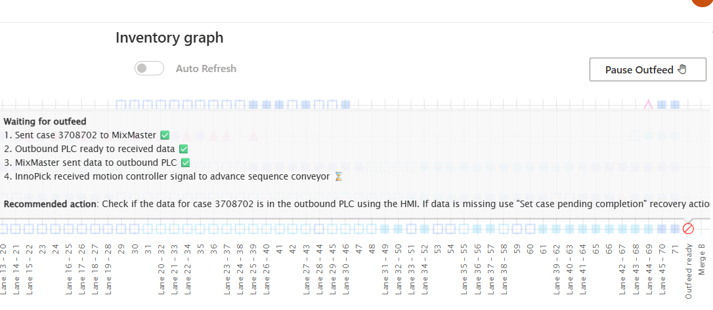

# Common Issues

**[Home](../index.md) > [Troubleshooting](index.md) > Common Issues**

---

## Overview

This page addresses frequently encountered issues that may not have specific alert codes but require operator attention and intervention.

---

## Outfeed Issues

---

### Cases Not Exiting InnoPick

**Symptoms:**
- Cases stuck at outfeed position
- Output has stopped
- Accumulation showing as full
- Levels remain in Auto but no output

**Common Causes:**
- Downstream conveyor system stopped or faulted
- Accumulation space completely full
- HOLD active on outbound conveyor system
- Communication error with downstream equipment
- Photocell at exit blocked

**Solution:**
1. **Check downstream equipment status:**
   - Check for faults on outbound conveyor HMI
   - Look for HOLDs or stopped conditions

2. **Check Inventory Graph Outfeed statuses:**
   - On the [Home Page, look at the output statuses](/main-screens/home-page.md#statuses-at-the-outfeed)
  
3. **Coordinate with downstream operators:**
   - Communicate the issue
   - Verify when downstream will be ready
   - May need to wait for accumulation to clear

4. **Check InnoPick settings:**
   - Check if [Pause Outfeed](/main-screens/home-page.md#pause--resume-outfeed) is active
   - Verify [Buffer settings](/main-screens/administration.md#buffer)

5. **If issue persists:**
   - If no explanation can be found for the stoppage, contact support

---
### Next Outfeed Case Data is not in Outbound Conveyor System
**Symptoms:**
- The case at the outfeed position of InnoPick is waiting for the "Ok to Receive" signal from the downstream conveyor system
- It is determined that the case's data has not been received by that system

**Solution:**
- Check the details of the transfer sequence by hovering over the case on the Inventory Graph:

The steps for each case transfer are as follows:
1. Send case to MixMaster
   - This is done automatically when the case arrives at the last InnoPick position
2. Outbound PLC ready to receive data
   - InnoPick checks to see if the outbound PLC is ready for new case data
3. MixMaster sends data to outbound PLC
   - MixMaster sends case data to the outbound PLC
4. Outbound PLC sends the "Ok to Receive" signal to InnoPick
5. InnoPick advances the case and transfers it to the outbound conveyor system.

- The pop-up which appears when the cursor hovers over the case on the outfeed position shows what steps have been completed to date for this case.

- If step 3 has a checkmark next to it (as in the screenshot above), then MixMaster has already sent the case data to the outbound PLC, and it will not re-send it unless a recovery action is used.
- Therefore, if the outbound PLC does not have the case data, the operator can use the recovery action **["Set case pending completion"](/main-screens/administration.md#set-case-pending-completion)**

**Note: This recovery action re-sends the case data to the outbound PLC. If the data was already there, the downstream system will have a duplicate data which can cause serious tracking issues. Use with caution and monitor downstream system for any issues after using.**

---

### Next Outfeed Case not advancing despite all conditions met
**Symptoms:**
- If the outbound PLC does have case data for the next outfeed case
- And the Inventory Graph shows that all steps have been completed for the case transfer
- And all other likely causes have been ruled out (system is not in manual, not faulted, downstream conveyor is not full, faulted, or held, etc)
- But the case still does not advance
 
**Solution:**
- It may be necessary to force the case forward using the recovery action called **["Set OuXfEna=1 for level"](/main-screens/administration.md#set-ouxfena1-for-level)**

**Note: This recovery action will force the sequence conveyor to move forward. If it is used incorrectly or in the wrong scenario, it will make the situation worse. Use with caution.**

---

## Infeed Issues

### Cases Not Being Inducted

**Symptoms:**
- Replenishments show "Inducting" but cases not entering InnoPick infeed
- Upstream conveyor has cases but won't release them

**Common Causes:**
- HOLD active on inbound conveyor system
- No Replenishment in the **Inducting** status
- InnoPick at capacity (all lanes full) on that level
- Communication / handshake error between systems
- **Pause Infeed** enabled in InnoPick
- If following a system reboot, a recovery action is needed

**Solution:**
1. **Check upstream conveyor system:**
   - Verify no HOLD is active
   - Check HMI for faults or stopped conditions
   - Verify that cases are not physically jammed
   - Confirm cases have correct tracking data and are ready to release

2. **Check InnoPick capacity:**
   - Review [Lane Inventory](../main-screens/inventory-section.md#lane-inventory-page)
   - Verify lanes available for induction
   
3. **Check InnoPick settings:**
   - Verify Pause Infeed is not active on the Home page

4. **Check Replenishments Status on that level**
   - Go to the Replenishments Page
   - Filter for the level in question
   - Make sure the replenishment associated with the cases at the infeed is in the state **Inducting**
   - If not, investigate why, and then manually set the replenishment to **Inducting**
   - [See here for more info on the Replenishments Page](/main-screens/inventory-section.md#replenishments-page)
5. **If a system or motion controller reboot occured recently:**
   - Use the recovery action [Set InCasLen](../main-screens/administration.md#set-incaslen) for the level in question.

---

### Wrong Product Being Inducted

**Symptoms:**
- [Alert 517](/troubleshooting/alert-reference.md#517---infeed-cases-length-too-short) (incorrect case length)
- Cases don't match expected replenishment
- Lane contains mixed products

**Common Causes:**
- Operator error in selecting pallet
- Tracking data mismatch in inbound conveyor system
- Upstream case routing mixup
- Cases were removed without updating upstream conveyor system or the InnoPick replenishment

**Solution:**
1. **Stop induction immediately:**
   - Put level in Manual mode
   - Prevent more wrong cases from entering

2. **Verify what was expected:**
   - Check [Replenishments Page](../main-screens/inventory-section.md#replenishments-page)
   - Note expected product SKU
   - Check inducted quantity
   - Check recently filled lanes for incorrect inventory

4. **Coordinate with upstream operators:**
   - Inform depalletizer operator or appropriate personnel

5. **Resolve the issue:**
   - Remove wrong cases from InnoPick
   - Adjust replenishment quantities as needed
   - Adjust buffer lane inventory as needed
   - Correct upstream tracking if needed

6. **Resume InnoPick production**
   - Pay close attention to the first transitions between replenishments 

---

### Inventory Tracking Not Matching Physical Reality

**Symptoms:**
- [Alert 121](/troubleshooting/alert-reference.md#121---photocell-above-lane-never-detected-the-case-during-a-storing-move) or [Alert 123](/troubleshooting/alert-reference.md#123--124---photocell-above-lane-never-detected-the-case-during-a-dispense-move) (cases not found where expected)
- Outfeed alerts (expecting case but none present, or vice versa)
- Lane inventory counts don't match physical count

**Common Causes:**
- Improper alert recovery
- Skipped verification after clearing alerts
- Cases manually moved without updating system
- Motion controller thread crash ([Alert 791](/troubleshooting/alert-reference.md#517---infeed-cases-length-too-short))
  
**Solution:**
1. **Put level in Manual mode**

2. **Conduct physical inventory check:**
   - Compare each affected lane to [Lane Inventory Page](../main-screens/inventory-section.md#lane-inventory-page)
   - Compare sequence conveyor to [Inventory Graph](../main-screens/home-page.md#inventory-graph)
   - Fix all discrepancies

3. **Correct lane inventory:**
   - Use [Edit Lane Inventory](../main-screens/inventory-section.md#editing-lane-inventory) feature
   - Adjust quantities to match physical reality
   - Update product types if wrong

4. **Correct sequence conveyor tracking:**
   - May need to jog conveyor to align cases
   - Remove or add cases as needed to match Inventory Graph
   - Follow [Case Replacement](case-replacement.md) procedures

5. **Clear all alerts** after corrections

6. **Resume in Auto and monitor closely:**
   - Watch first several cycles carefully
   - Verify tracking stays accurate

7. **Prevent recurrence:**
   - Always verify Inventory Graph after clearing alerts
   - Never assume - always check
   - Train operators on proper procedures

---

### Frequent Alerts on Specific Products

**Symptoms:**
- Certain SKUs causing repeated alerts
- Same product repeatedly has storage/dispense issues
- Product-specific fault patterns

**Common Causes:**
- Case dimensions incorrectly configured
- Case quality issues (weak, damaged, irregular)
- Acceleration settings too aggressive for product

**Solution:**
1. **Review product configuration:**
   - Check acceleration settings in the [Products Page](../main-screens/inventory-section.md#products-page)
   - Verify dimensions are correct in MixMaster product configurations (length, width, height)

2. **Inspect physical cases:**
   - Look for damage, weak boxes, irregular shapes

3. **Adjust settings:**
   - Lower acceleration if cases are unstable
   - This is modified in the **[Products Page](/main-screens/inventory-section.md#products-page)**
4. **Test and monitor:**
   - Monitor results over several cycles

5. **Consider removing product from InnoPick**
   - If the product is very problematic such that it is slowing down the entire production and the problems cannot be resolved by parameter changes, it may be better to remove the product from automation.
---

## Related Topics

- [Alert Reference](alert-reference.md) - Specific alert code resolutions
- [Alert Guidelines](alert-guidelines.md) - General troubleshooting principles
- [Monitoring Production](../daily-operations/index.md#monitoring-production) - Catching issues early
- [Case Replacement](case-replacement.md) - Replacing problem cases

---

**Navigation:** [← Alert Reference](alert-reference.md) | [Next: Case Replacement →](case-replacement.md)