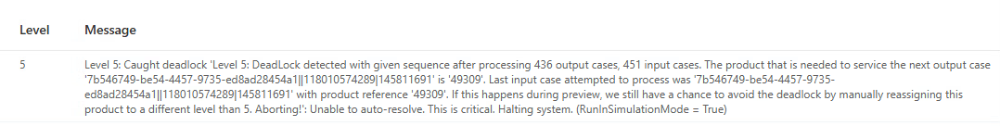

# Deadlocks

**[Home](../index.md) > [Troubleshooting](index.md) > Deadlocks**

---

## Overview

This section provides guidance for resolving deadlock situations.
A deadlock is when InnoPick is not able to fit all the cases that are due to enter the infeed, and it cannot make room by outputting cases because the next case needed for the sequence is coming after those cases which cannot fit. 
In other words, a deadlock is when a level of InnoPick is too full and becomes stuck. 

---

## Types of Deadlocks

There are two types of deadlocks:
1. Preview deadlock (forecast) - warns the operator that a deadlock will occur unless something is done to avert it.
2. Just-in-Time deadlock - the system is in a deadlock state and cannot proceed without an operator intervention.

---

## Preview Deadlock

"Level 2. Deadlock detected with given sequence after processing 940 output cases, 850 input cases."

The following is an example alarm message for a preview deadlock:
- *[Level 5] Level 5: Caught deadlock 'Level 5: DeadLock detected with given sequence after processing 111 output cases, 166 input cases. The product that is needed to service the next output case '0aa249a6-d163-4bb2-bfe9-9da964345d38|000000006500247839|119003120537|129563670' is '47692'. Last input case attempted to process was '0aa249a6-d163-4bb2-bfe9-9da964345d38|000000006500247839|119003120537|129563670' with product reference '47692'. If this happens during preview, we still have a chance to avoid the deadlock by manually reassigning this product to a different level than 5. Aborting!': Unable to auto-resolve. This is critical. Halting system. (RunInSimulationMode = False)*

**Key Points:**
- The deadlock is detected after processing a number of output and input cases
- This forecasts a future deadlock if nothing changes
- Manual reassignment of the key product to a different level can prevent it
- The system automatically enters manual mode to allow operator intervention

**Understanding the Causes of Preview Deadlocks**
Preview deadlocks can be generated by one or more factors. 
- There are too many products assigned to a single level of InnoPick, and the system has not found any way to avoid a deadlock situation.
- A replenishment has come in out of order (before the next priority replen), meaning it has to be stored completely in order for the priority replen can be brought in.
- The number of enabled buffer lanes was reduced since the initial case sequence calculation.
- A replenishment was shorted, but the shorted cases were needed to complete the case sequence. Now a new replen has been generated but the system has to store the active replens that are in the pipeline before it.

**Resolving a Preview Deadlock**
- Note the product # and use the [Products Page](/main-screens/inventory-section.md#products-page) to re-assign it to another level.
- After this, the system will re-calculate the case sequence and may re-generate a preview deadlock fault depending on the context.
- Continue re-assigning the problematic product (as listed in the preview deadlock alert message) until no new preview deadlock alerts are generated.

## Just-In-Time Deadlocks

A Just-In-Time deadlock occurs when a level of InnoPick is full and cannot make even one move. 
This can happen if:
- A preview deadlock is ignored / not resolved and the system is allowed to continue operating.
- Some unexpected change has occurred, and InnoPick can no longer continue on that level, such as the disabling of a lane that InnoPick was expecting to be able to use. 

Example of a Just-in-Time deadlock alert message:

- *[Level 5] Warning: Just In Time deadlock detected on Level 5. The product that is needed to service the next output case '0aa249a6-d163-4bb2-bfe9-9da964345d38|000000006500247839|119003120537|129563670' is '47692'. Please fix manually!!!*

**Resolving a Just-In-Time Deadlock**
The simplest way to resolve a Just-In-Time deadlock is to:
  1. Identify some lanes on that level with low inventory (1-10 cases)
  2. Makes sure those cases are not immediately going to be needed (using the [Case Sequence Page](/main-screens/case-sequence.md))
  3. Empty those lanes, making them available.

Alternatively, another option is to:
1. Identify which product InnoPick needs in order to resume outputting cases (this is listed in the Alert message).
2. Filter the [Case Sequence Page](/main-screens/case-sequence.md) to see how many cases of this product are needed. 
3. Manually load this number of cases of the required product in an empty lane on that level of InnoPick. 
4. Edit the inventory for that lane and save the changes, using the [Inventory Page](/main-screens/inventory-section.md#alter-quantity). 
5. Upon saving the changes to the inventory change, the system should recalculate the case sequence for that level and production should resume.
6. If needed, use the "Recalculate Level" [Recovery Action](/main-screens/administration.md#recovery-actions).

**Navigation:** [← Case Centering](casecentering.md) | [Next: Disabled Lane →](disabledlane.md)